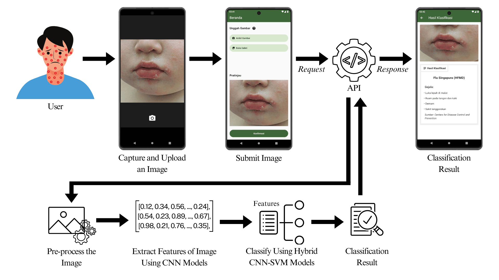

# Apps Skin Disease Classifications

Welcome to the **Skin Disease Classifications Apps**! This application is designed to assist users in identifying various skin diseases through advanced classification techniques. The app is integrated with [Hybrid CNN-SVM](https://github.com/SkinDiseaseClassifications/skin_disease_classifications_models) model via an API to classify skin diseases.

<br>

To use the app, simply upload an image and submit it. The image will be sent to the API, which will return a response containing the classification results.



<br>


> [!NOTE]
> The current App is only have Indonesian language. English language will be available in a future update.

## Features
|     Home.png)     |      Tutorial.png)        |      CaptureImage.png)      |
|:----------------------:|:----------------------:|:----------------------:|
|        Home     |        Tutorial     |        Capture an Image     |
|     CropImage.png)     |      ProcessingImage.png)        |      Result.png)      |
|        Crop Image     |        Processing Image     |        Result     |

## Install Dependencies.

> [!IMPORTANT]
> This app is built using **Flutter v3.25.0**.

This application uses the following dependencies:

- image_picker: ^1.0.8
- image_cropper: ^8.0.2
- flutter_dotenv: ^5.1.0

#### You can install the required dependencies by running the following command in your terminal:

```bash
flutter pub get
```

## Running the App

Make sure the device you want to use is powered on.

#### Additional Steps if You Are Using a Physical Device:

1. If you are using a physical device, ensure that debug mode is enabled (this can be activated in Developer Options).
2. Find your local IP address (e.g., `192.168.1.10`).
3. Update the IP address in the .env file using the following command, replacing x.x.x.x with your IP address.

> [!CAUTION]
> Before running the application, ensure that the API is running. If not, please follow the step-by-step instructions in the documentation [here](https://github.com/SkinDiseaseClassifications/skin_disease_classifications_api?tab=readme-ov-file#api-skin-disease-classifications).

#### You can install the app on your device by running the following command in your terminal:

```bash
flutter run
```

<br>
